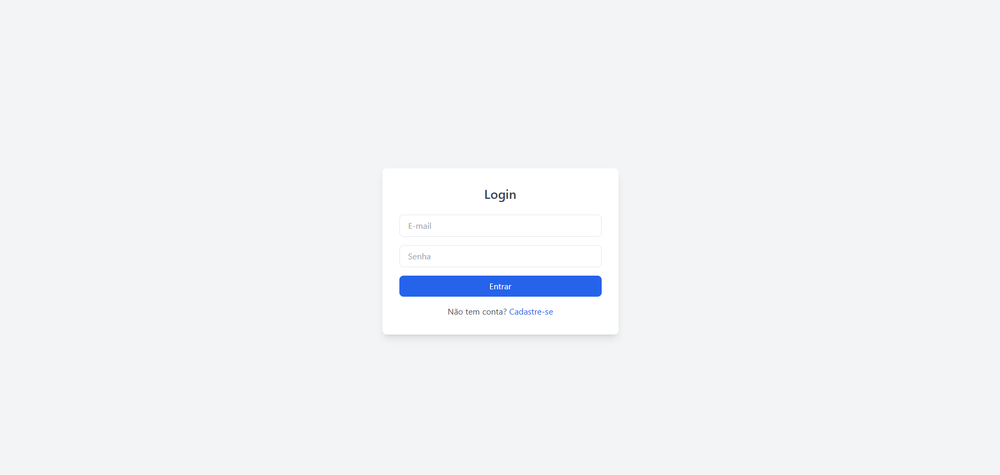
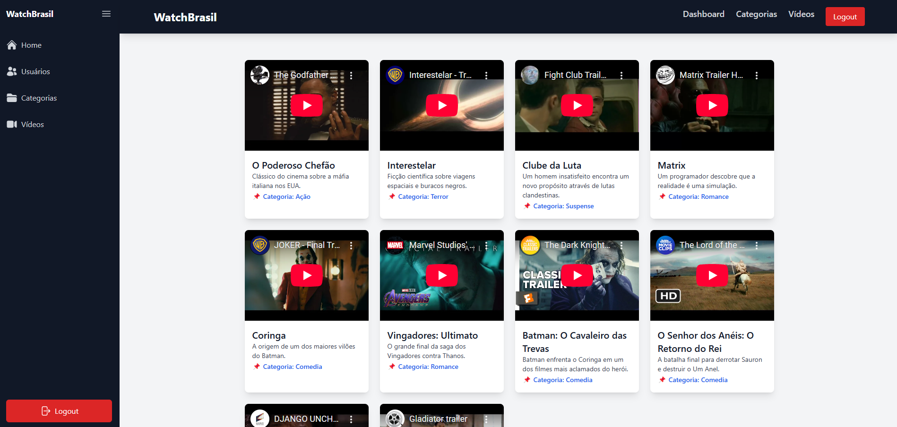

# Fullstack Project - Watch Brasil

 **Gerenciamento de vídeos e categorias com autenticação de usuários**

---

## Sobre o Projeto

Este é um **sistema Fullstack** desenvolvido como parte de um **desafio técnico da Watch Brasil**. O sistema permite que os usuários **cadastrados e autenticados** possam **gerenciar vídeos e categorias**.

O projeto conta com **autenticação JWT**, um **backend em Node.js com Fastify** e um **frontend moderno com Vue.js e TailwindCSS**.

---

## Tecnologias Utilizadas

### Backend
- 
- 
- 
- 

### Frontend
- 
- 
- 

### Ferramentas de Desenvolvimento
- 
- 
- 

---

## Instalação do Projeto

### 🔹 **Pré-requisitos**
Antes de iniciar, certifique-se de ter instalado:
- **[Node.js](https://nodejs.org/en/download/)** (v20+)
- **[Docker](https://www.docker.com/get-started)**
- **[Git](https://git-scm.com/)**

### **Clone o repositório**
```bash
# Clone este repositório
$ git clone https://github.com/Woschbrayan/fullstack-project.git

# Acesse a pasta do projeto
$ cd fullstack-project
```

### **Configuração do Backend**
```bash
# Acesse a pasta backend
$ cd backend

# Instale as dependências
$ npm install

# Inicie o banco de dados no Docker
$ docker-compose up -d

# Execute as migrations do Prisma
$ npx prisma migrate dev --name init

# Rode o servidor backend
$ node server.js
```
O backend rodará em: `http://localhost:3000`

### **Configuração do Frontend**
```bash
# Acesse a pasta frontend
$ cd ../frontend

# Instale as dependências
$ npm install

# Execute o projeto
$ npm run dev
```
O frontend rodará em: `http://localhost:5173`

---

## Endpoints da API

| Método | Rota           | Descrição                        |
|--------|---------------|--------------------------------|
| POST   | `/login`      | Autenticação e geração de JWT |
| POST   | `/users`      | Criação de usuários           |
| GET    | `/users`      | Listagem de usuários          |
| POST   | `/categories` | Criação de categorias         |
| GET    | `/categories` | Listagem de categorias        |
| POST   | `/videos`     | Cadastro de vídeos            |
| GET    | `/videos`     | Listagem de vídeos            |

---

## Testes
O projeto possui **testes unitários e de integração** utilizando **Jest e Supertest**.

```bash
# Executar testes unitários
$ npm test

# Testes de carga com K6
$ k6 run load-test.js
```

---
## Screenshots

### Tela de Login


### Home



**Desenvolvido por [Brayan Wosch](https://github.com/Woschbrayan)**
